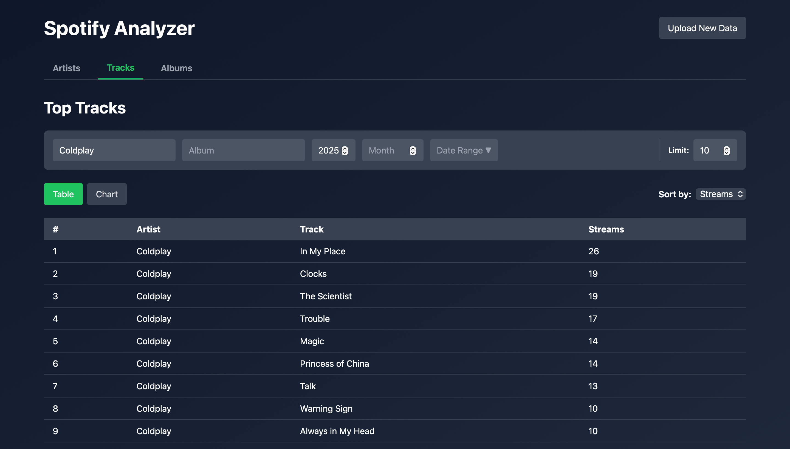

# Spotify Analyzer

A web-based application for analyzing your Spotify listening history.

Upload your Spotify listening history and explore your most-played artists, tracks, and albums, with filters for different time periods and other criteria.



## Features

* Analyze your Spotify listening history
* View your top artists, tracks, and albums
* Filter results by year, month, or date range
* Filter tracks and albums by artist
* Sort results by stream count or listening time
* View total listening time and stream counts
* Upload multiple Spotify JSON files
* Modern React web interface
* Standalone desktop application with no Python or Node.js required

## Download

Download the latest version from the
[GitHub Releases](../../releases/latest) page.

### macOS

Download `Spotify-Analyzer-macOS.zip`, extract it, and open `Spotify Analyzer.app`.

No Python or Node.js installation is required.

#### macOS Security Notice

Because the application is currently not notarized by Apple, macOS may display a security warning when opening it for the first time.

If this happens, go to **System Settings → Privacy & Security** and click **Open Anyway** for Spotify Analyzer.

#### If the browser does not open automatically

The application starts a local server and should automatically open Spotify Analyzer in your browser.

If the browser does not open automatically, open your browser and go to:

`http://127.0.0.1:8000`

The application must remain open while using Spotify Analyzer.


## Getting Your Spotify Data

Spotify allows you to download your listening history from your account's privacy settings.

1. Go to [Spotify Account Privacy](https://www.spotify.com/account/privacy/)
2. Request your data download
3. Wait for Spotify to prepare your data
4. Download and extract the archive
5. Locate the JSON files containing your streaming history

The application supports Spotify's extended streaming history files, such as:

```text
Streaming_History_Audio_*.json
```

You can upload one or multiple JSON files directly through the application.

## Running Locally

### Backend

Python 3.9 or later is required.

Install the dependencies:

```bash
pip install -r requirements.txt
```

Start the application:

```bash
python app.py
```

The application starts the Flask server and automatically opens the web interface in your browser.

By default, the application runs at:

```text
http://127.0.0.1:8000
```

### Frontend Development

The frontend is built with React.

From the `spotify-frontend` directory:

```bash
npm install
npm start
```

The React development server runs at:

```text
http://localhost:3000
```

To build the production frontend:

```bash
npm run build
```

The production build is served directly by Flask.

## Architecture

Spotify Analyzer consists of a React frontend and a Python/Flask backend.

```text
┌─────────────────────────┐
│      React Frontend     │
│                         │
│ Artists · Tracks ·      │
│ Albums · Filters        │
└────────────┬────────────┘
             │ HTTP
             ▼
┌─────────────────────────┐
│      Flask Backend      │
│                         │
│ REST API · File Upload  │
└────────────┬────────────┘
             │
             ▼
┌─────────────────────────┐
│     Spotify Analyzer    │
│                         │
│ Loading · Filtering ·   │
│ Analysis · Aggregation  │
└─────────────────────────┘
```

In production, Flask serves both the API and the React production build, allowing the entire application to run from a single local server.

## Data Processing

The analyzer processes Spotify's JSON listening history before performing the analysis.

### Excluded

* Podcasts
* Audiobooks
* Plays shorter than 15 seconds

### Included

* Music tracks from the Spotify listening history

### Metrics

The application supports metrics including:

* Stream count
* Total listening time

Results can be filtered by different time periods and dimensions depending on the selected analysis.

## Project Structure

```text
spotify-analyzer/
│
├── app.py                 # Application entry point
├── app.spec               # PyInstaller configuration
├── requirements.txt
├── README.md
│
├── src/
│   ├── api.py             # Flask API and React serving
│   ├── analyzer.py        # Analysis and query logic
│   ├── loader.py          # Spotify JSON loading and filtering
│   ├── models.py          # Data models
│   └── __init__.py
│
└── spotify-frontend/
    ├── src/
    │   ├── components/
    │   └── pages/
    ├── public/
    └── package.json
```

## Tech Stack

### Frontend

* React
* JavaScript
* Recharts

### Backend

* Python
* Flask
* Flask-CORS

### Packaging

* PyInstaller

## Standalone Application

The application can be packaged as a standalone desktop application using PyInstaller.

The packaged application includes the Python backend and React production build, so users do not need to install Python or Node.js.

### macOS

Build the application with:

```bash
pyinstaller --clean app.spec
```

The application will be generated in:

```text
dist/Spotify Analyzer.app
```

### Windows

The Windows executable can be generated using PyInstaller from a Windows environment.

PyInstaller builds are platform-specific, so the Windows executable must be built on Windows.

## Future Work

- Windows standalone executable

